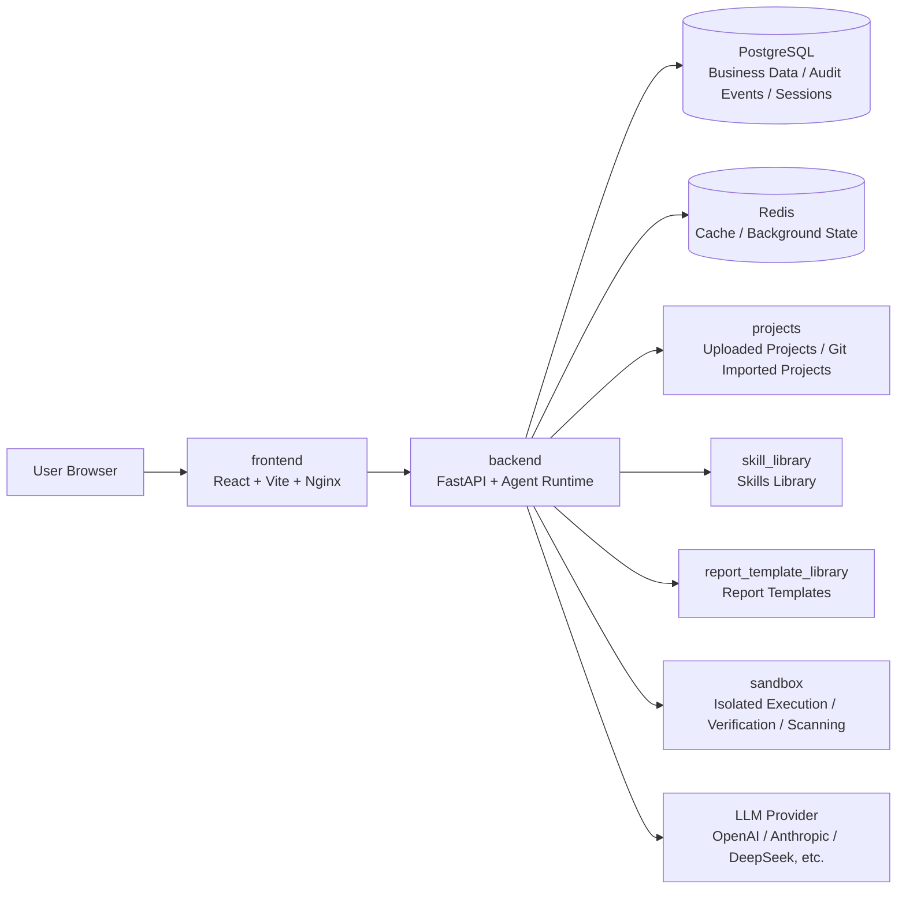
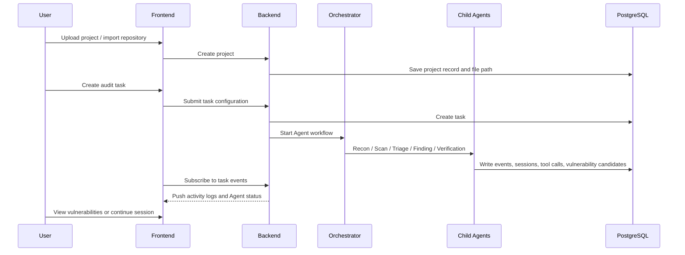
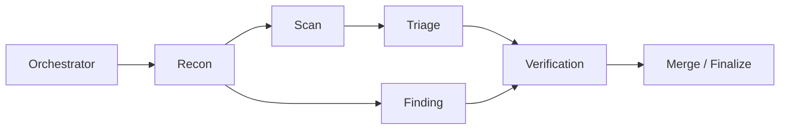
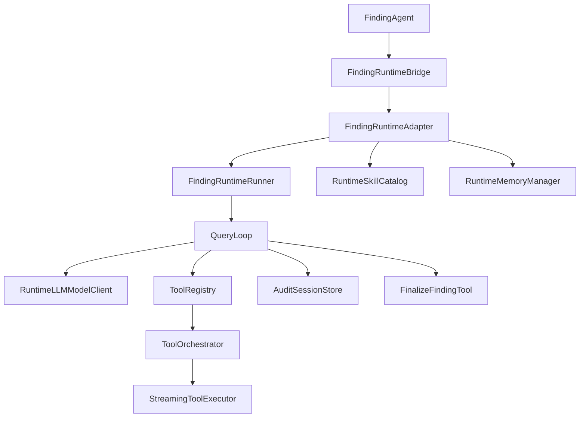
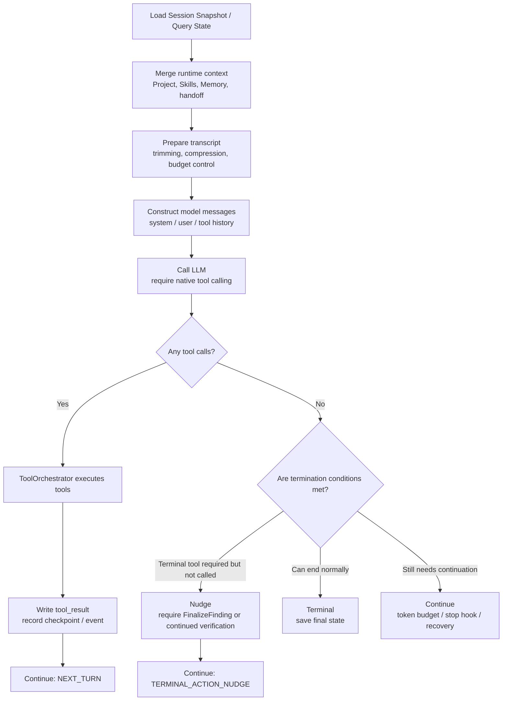

# AutoCVE Architecture Design Document

> This document explains AutoCVE's overall architecture, frontend and backend code structure, Agent workflow, Agent coordination mechanism, and the engineering implementation of Finding Agent.  

## Table of Contents

- [AutoCVE Architecture Design Document](#autocve-architecture-design-document)
  - [Table of Contents](#table-of-contents)
  - [1. Project Positioning](#1-project-positioning)
  - [2. Overall Architecture](#2-overall-architecture)
    - [2.1 Frontend Responsibilities](#21-frontend-responsibilities)
    - [2.2 Backend Responsibilities](#22-backend-responsibilities)
    - [2.3 Storage and Runtime Components](#23-storage-and-runtime-components)
  - [3. Code Directories](#3-code-directories)
    - [3.1 Root Directory](#31-root-directory)
    - [3.2 Frontend Directory](#32-frontend-directory)
    - [3.3 Backend Directory](#33-backend-directory)
  - [4. Main Business Flow](#4-main-business-flow)
  - [5. Agent Workflow Architecture](#5-agent-workflow-architecture)
    - [5.1 Agent Types](#51-agent-types)
    - [5.2 Workflow Orchestration](#52-workflow-orchestration)
    - [5.3 Agent Coordination Mechanism](#53-agent-coordination-mechanism)
    - [5.4 Events and Activity Logs](#54-events-and-activity-logs)
  - [6. Tool System](#6-tool-system)
    - [6.1 Tool Set](#61-tool-set)
    - [6.2 Tool Orchestration](#62-tool-orchestration)
      - [6.2.1 ToolRegistry](#621-toolregistry)
      - [6.2.2 ToolOrchestrator](#622-toolorchestrator)
      - [6.2.3 StreamingToolExecutor](#623-streamingtoolexecutor)
    - [6.2.4 Context Modifier Merging](#624-context-modifier-merging)
    - [6.3 Tool Permissions and Protection](#63-tool-permissions-and-protection)
  - [7. Finding Agent Architecture](#7-finding-agent-architecture)
    - [7.1 Finding Runtime Components](#71-finding-runtime-components)
    - [7.2 ReAct Loop](#72-react-loop)
    - [7.3 Continue Node Conditions](#73-continue-node-conditions)
    - [7.4 Terminal Node Conditions](#74-terminal-node-conditions)
    - [7.5 FinalizeFinding Termination Tool](#75-finalizefinding-termination-tool)
  - [8. Nudge Trigger Mechanism](#8-nudge-trigger-mechanism)
    - [8.1 Native Tool Calling Reminder](#81-native-tool-calling-reminder)
    - [8.2 Text Pseudo-Tool Syntax Nudge](#82-text-pseudo-tool-syntax-nudge)
    - [8.3 Terminal Action Nudge](#83-terminal-action-nudge)
    - [8.4 Continue Intent Nudge](#84-continue-intent-nudge)
    - [8.5 Token Budget Continuation](#85-token-budget-continuation)
    - [8.6 Stop Hook Blocking](#86-stop-hook-blocking)
    - [8.7 Finalizer Recovery](#87-finalizer-recovery)
  - [9. Skill Mechanism](#9-skill-mechanism)
    - [9.1 Progressive Disclosure](#91-progressive-disclosure)
    - [9.2 Skill Loading Flow](#92-skill-loading-flow)
    - [9.3 Skill Tool](#93-skill-tool)
    - [9.4 Explicit Skill Invocation](#94-explicit-skill-invocation)


## 1. Project Positioning

AutoCVE is an Agent-based audit platform for code security auditing and CVE discovery. The system is designed around the workflow of "project upload/import -> automated audit task -> Agent workflow analysis -> structured vulnerability result output -> one-click CVE submission", while also retaining features such as user conversation, activity logs, Skills management, and model plan configuration, making it convenient for users to continue asking questions, supplement evidence, and expand analysis on top of automated audits.

## 2. Overall Architecture

The system consists of the frontend, backend, database, Redis, sandbox, project file area, Skills library, and report template library.



### 2.1 Frontend Responsibilities

The frontend is responsible for providing a productized operation interface, including:

- Dashboard: overall project overview
- Project management: project upload, project list, project details
- Audit tasks: create tasks, view execution process, view activity logs
- Agent audit page: display Agent execution status, tool calls, reasoning process, phase progress, and results
- Audit sessions: use the full audit process as context, allowing users to continue conversing with the Agent around a specific audit, add questions, supplement verification ideas, or let the Agent expand analysis
- Vulnerability management: view, filter, confirm, and follow up on vulnerability results
- One-click CVE: centered on the core goal of CVE discovery, automatically select projects from GitHub and continuously create audit tasks until the Agent discovers the specified number of CVE candidate vulnerabilities
- Skills management: Skills import and management, supporting different Skills for different Agents
- System settings: configure different model plans for different Agents and toggle workflow Agent nodes

### 2.2 Backend Responsibilities

The backend is the execution hub of the entire platform. It converts projects, tasks, model plans, and Agent configurations initiated from the frontend into a traceable audit process. It not only stores business data, but also schedules Agents, manages tool calls, records the audit process, and persists final vulnerability results as structured assets.

- Business control plane: handles product features such as user login state, project upload and import, audit task creation, model plan configuration, workflow switches, vulnerability result management, report templates, and Skills management.
- Audit workflow: starts the Orchestrator according to task configuration. The Orchestrator schedules Agent nodes such as Recon, Scan, Triage, Finding, and Verification according to a fixed flow, ensuring audit phases are predictable and replayable.
- Agent Runtime: provides a session-style runtime environment for nodes such as Finding and Triage, responsible for model calls, context assembly, ReAct loop, Continue/Terminal state transitions, nudge triggers, and final result validation.
- Tool execution layer: centrally manages registration, input validation, permission checks, concurrency orchestration, and execution records for tools such as Read, Glob, Grep, Bash, PowerShell, Skill, and FinalizeFinding.
- Audit process persistence: continuously stores Agent messages, tool calls, handoffs, checkpoints, memory, traces, and activity logs, enabling the frontend to display the real-time process and allowing users to continue conversations later based on the same audit.
- Secure execution boundary: places high-risk actions such as scanning, verification, code execution, and PoC experiments in a sandbox or controlled toolchain to prevent the Agent from directly performing uncontrolled operations in the host environment.

### 2.3 Storage and Runtime Components

- PostgreSQL: stores business data such as users, projects, tasks, vulnerabilities, Agent events, Audit Sessions, tool calls, and runtime status
- Redis: used for runtime cache, asynchronous task status, or short-term state coordination
- `projects/`: stores uploaded or imported projects to be audited
- `skill_library/`: stores Skills for Agents to load on demand during audits
- `report_template_library/`: stores report templates
- `docker/sandbox/`: defines the sandbox image and isolated runtime environment

## 3. Code Directories

### 3.1 Root Directory

```text
.
├── backend/                    # FastAPI backend, business services, Agent Runtime
├── frontend/                   # React + Vite frontend
├── docker/                     # Docker-related files, including the sandbox image
├── docs/                       # Project documentation such as user guide and architecture docs
├── projects/                   # Local workspace after project upload/import
├── skill_library/              # Skills library
├── report_template_library/    # Report template library
├── rules/                      # Rules or audit-related materials
├── scripts/                    # Helper scripts
├── supabase/                   # Supabase/database-related materials
├── docker-compose.yml          # Default one-click deployment orchestration
├── docker-compose.prod.yml     # Production deployment orchestration
└── README.md
```

### 3.2 Frontend Directory

The frontend entry point is in `frontend/src`.

```text
frontend/src
├── app/
│   ├── App.tsx                 # Application root component
│   ├── main.tsx                # Frontend entry point
│   ├── routes.tsx              # Route configuration
│   └── ProtectedRoute.tsx      # Login-protected route
├── pages/
│   ├── Dashboard.tsx           # Dashboard
│   ├── Projects.tsx            # Project list
│   ├── ProjectDetail.tsx       # Project details
│   ├── AuditTasks.tsx          # Audit task list
│   ├── TaskDetail.tsx          # Task details
│   ├── AgentAudit/             # Agent audit execution page
│   ├── AuditSession/           # Audit session page
│   ├── OneClickCVE.tsx         # One-click CVE
│   ├── SkillsManager.tsx       # Skills management
│   ├── VulnerabilityManagement.tsx
│   ├── ReportTemplatesPage.tsx
│   ├── AdminDashboard.tsx
│   └── Account.tsx
├── components/
│   ├── agent/                  # Components for Agent status, tree, execution panels, etc.
│   ├── audit/                  # Audit-related components
│   ├── dashboard/              # Dashboard components
│   ├── layout/                 # Layout and navigation
│   ├── report/                 # Report-related components
│   ├── system/                 # System settings components
│   ├── ui/                     # Common UI components
│   └── vulnerability/          # Vulnerability display and management components
├── features/
│   ├── project/                # Project-related business encapsulation
│   ├── reports/                # Report business encapsulation
│   └── analysis/               # Analysis/scanning capability encapsulation
└── shared/
    ├── api/                    # Request encapsulation
    ├── config/                 # Frontend configuration
    ├── constants/              # Constants
    ├── context/                # Global context
    ├── hooks/                  # Common Hooks
    ├── services/               # Frontend service layer
    ├── types/                  # Type definitions
    └── utils/                  # Utility functions
```

The main frontend route line is "project -> task -> Agent audit -> vulnerability results/audit session". Specifically:

- `/projects` and `/projects/:id` carry project management
- `/audit-tasks` and `/tasks/:id` carry task management
- `/agent-audit/:taskId` displays the real-time process during Agent execution
- `/audit-sessions/:sessionId` supports continuing audit-session conversations
- `/one-click-cve` provides a quick entry point for CVE discovery scenarios
- `/vulnerabilities` aggregates vulnerability results
- `/skills` manages Skills

### 3.3 Backend Directory

The backend entry point is in `backend/app`.

```text
backend/app
├── main.py                     # FastAPI application entry point
├── api/
│   └── v1/endpoints/           # Business route entry points
├── core/                       # Core capabilities such as configuration, security, and logging
├── db/                         # Database sessions and initialization
├── models/                     # SQLAlchemy models
├── schemas/                    # Pydantic Schemas
├── services/
│   ├── agent/                  # Agent definitions, orchestrator, phase tools
│   ├── finding_runtime/        # New Finding Agent runtime
│   ├── runtime_core/           # Common Runtime tools, permissions, hooks, session state
│   ├── agent_runtime/          # Common runtime bridge/spec, currently used for Triage runtime
│   ├── scan_runtime/           # Scan pipeline
│   ├── triage_runtime/         # Scan result review runtime
│   ├── one_click_cve/          # One-click CVE related capabilities
│   ├── llm/                    # LLM Provider adapters
│   ├── rag/                    # Retrieval-augmented capabilities
│   └── ...                     # Services for projects, vulnerabilities, reports, configuration, etc.
└── utils/                      # Common utility functions
```

Agent-related code is mainly divided into three layers:

- `services/agent/`: contains definitions for Agents such as Orchestrator, Recon, Scan, Triage, Finding, and Verification.
- `services/finding_runtime/`: contains QueryLoop, Runner, Bridge, SessionStore, Memory, Skills, and Finalizer.
- `services/runtime_core/`: contains reusable runtime tool registration, tool orchestration, permissions, shell runtime, hooks, session checkpoints, skill discovery, etc. across Agents.

## 4. Main Business Flow

A typical audit flow is as follows:



From a product perspective, users only need to care about:

1. Whether the project has been imported
2. Whether the task goal, target files, and exclusion rules are reasonable
3. Whether the model plan and Agent configuration meet the current audit depth
4. Whether the Agent has produced credible evidence
5. Whether the vulnerability has been verified and is suitable for further CVE preparation

From an engineering perspective, the backend needs to ensure that:

1. Project files can be safely read by tools
2. Every Agent step has traceable events, tool calls, and session state
3. Tool execution does not exceed the project directory or permission policy
4. Vulnerability results are structurally validated and deduplicated before being stored
5. User follow-up conversations can reconnect to the previous audit flow

## 5. Agent Workflow Architecture

### 5.1 Agent Types

Current core Agents include:

| Agent | Main Responsibility |
| --- | --- |
| Orchestrator | Orchestrates the audit flow, decides which Agents to enable, and collects and merges results |
| Recon | Project reconnaissance; identifies languages, frameworks, entry files, and priority audit paths |
| Scan | Calls automated tools such as rule scans, dependency scans, and secret scans |
| Triage | Reviews candidate vulnerabilities produced by Scan, filters false positives, and supplements evidence |
| Finding | Directly reads code and discovers high-value vulnerabilities based on a ReAct loop plus state-machine scheduling mechanism |
| Verification | Uses sandbox, testing tools, and PoCs to dynamically verify vulnerabilities |

In code, these Agents are mainly located at:

- `backend/app/services/agent/agents/orchestrator.py`
- `backend/app/services/agent/agents/recon.py`
- `backend/app/services/agent/agents/scan.py`
- `backend/app/services/agent/agents/triage.py`
- `backend/app/services/agent/agents/finding.py`
- `backend/app/services/agent/agents/verification.py`

### 5.2 Workflow Orchestration
The workflow is as follows:


In the current implementation, the Orchestrator calculates the actual workflow according to task configuration, project scale, and Agent switches:

- Orchestrator and Recon are forcibly enabled by default
- After Scan is enabled, Triage has an input source
- Verification only has practical meaning when Triage or Finding is enabled
- For larger projects, Recon tends toward more complete project analysis; when there are fewer target files, it tends toward lightweight analysis

### 5.3 Agent Coordination Mechanism

Agents do not directly share a large block of unstructured text. Instead, they collaborate through the following mechanisms:

- `AgentResult`: standard execution result for each Agent
- `TaskHandoff`: structured handoff passed between phases
- Agent Registry: Orchestrator registers and looks up child Agents
- Event Emitter: execution phases, tool calls, reasoning processes, and handoffs all produce events
- Runtime Session: Finding/Triage runtime saves messages, tool calls, checkpoints, skills, and memory as recoverable sessions
- Finding Merge: Orchestrator merges duplicate vulnerabilities by `file_path + line_start + vulnerability_type`

Typical handoff content includes:

- Findings, summaries, and confidence from the previous phase
- Target files, basic project information, and recommended audit paths
- Raw candidates produced by Scan
- Credible candidates filtered by Triage
- Structured vulnerabilities produced by Finding
- Verification status and supplementary evidence for vulnerabilities from Verification

### 5.4 Events and Activity Logs

Events are continuously produced while Agents run, and are used for frontend activity logs, audit process display, and later troubleshooting. Common event types include:

- `phase_start`: phase started
- `phase_complete`: phase completed
- `thinking`: Agent or runtime reasoning/state
- `tool_call`: tool call started
- `tool_result`: tool call result
- `finding_new`: new vulnerability discovered
- `finding_verified`: vulnerability verified successfully
- `warning` / `error`: exception, degradation, or failure information
- `handoff_out` / `handoff_in`: handoff between Agents

## 6. Tool System

### 6.1 Tool Set

Agent Runtime uses the unified tool registration mechanism in `runtime_core`. The core entry point is `build_runtime_tool_registry`.

Using Finding Agent as an example, common tools during Finding Agent runtime include:

| Tool | Purpose |
| --- | --- |
| `Read` | Read the content of one or more files |
| `Glob` | List files by pattern |
| `Grep` | Search code snippets, keywords, functions, and dangerous calls |
| `Write` | Write artifacts or helper materials during the audit process |
| `Bash` | Execute shell commands when allowed |
| `PowerShell` | Execute PowerShell commands when allowed |
| `Skill` | Load matched Skill body or resources |
| `FinalizeFinding` | Terminate the Finding phase and submit structured vulnerability results |
| `FinalizeVulnerabilityReports` | Termination tool for vulnerability report generation scenarios |
| `TodoWrite` | Maintain runtime todos |
| `AskUser` | Request supplementary input when user input is needed |
| `ToolSearch` | Search available tools when deferred tools exist |

### 6.2 Tool Orchestration

#### 6.2.1 ToolRegistry

All Runtime tools first enter `ToolRegistry`. It is responsible for:

- Registering tool names and aliases
- Determining whether tools are enabled
- Returning active tools to the model
- Supporting deferred tools
- Registering `ToolSearch` when deferred tools exist

What the model sees in each round is not all backend capabilities, but the tool set available under the current Agent, current scenario, and current configuration.

#### 6.2.2 ToolOrchestrator

`ToolOrchestrator` is the execution entry point for tool calls. It is responsible for:

1. Receiving tool calls produced by the model
2. Looking up tool definitions
3. Validating inputs
4. Performing permission checks
5. Writing `AuditToolCall` records
6. Triggering `PreToolUse` checkpoints
7. Calling tools
8. Triggering `PostToolUse` or `PostToolUseFailure` checkpoints
9. Converting results into tool result messages

This gives tool calls an audit trail instead of being invisible internal function calls.

#### 6.2.3 StreamingToolExecutor

`StreamingToolExecutor` orchestrates the execution order of multiple tool calls in one model turn.

It groups tools according to their attributes:

- Read-only and concurrency-safe tools can be executed in parallel
- Tools with the same `concurrency_key` need to avoid interfering with each other
- Tools with side effects such as write, shell, and sandbox tools are usually executed serially
- If shell-like tools fail, related calls in the same batch can be aborted to avoid error propagation

This design lets the model propose multiple read or search actions at once while still controlling the risks of write and execution operations.

### 6.2.4 Context Modifier Merging

Some tools may return context modifiers after execution, which are used to modify runtime context. The executor merges these modifications after a batch ends before entering the next model call.

This means tools not only return text, but can also affect later Agent runtime state, for example:

- Update todos
- Update current plan mode
- Save user interaction state
- Update skill- or memory-related context

### 6.3 Tool Permissions and Protection

Runtime tools are not executed bare. Tool calls go through:

1. Input validation
2. Tool enabled-state check
3. Permission check
4. Guardrails check
5. Hook event record
6. Execution result record
7. Session state update

Tools such as `Write`, `Bash`, and `PowerShell`, which may modify files or execute commands, are subject to stricter permission and directory restrictions. The goal is to allow the Agent to perform actions necessary for auditing while avoiding unauthorized writes, source-code overwrites, or uncontrolled command execution.

## 7. Finding Agent Architecture

Finding Agent is the most core and engineering-distinctive Agent in the current project. Its responsibility is not to read and restate scanner candidates, but to directly perform vulnerability discovery on code and produce structured findings suitable for subsequent verification and CVE preparation.

### 7.1 Finding Runtime Components



Key files:

- `backend/app/services/finding_runtime/bridge.py`: connects the outer Agent layer with the runtime core
- `backend/app/services/finding_runtime/runner.py`: drives multi-turn QueryLoop
- `backend/app/services/finding_runtime/query_loop.py`: core ReAct loop
- `backend/app/services/finding_runtime/query_state.py`: loop state
- `backend/app/services/finding_runtime/query_transitions.py`: Continue/Terminal state transitions
- `backend/app/services/finding_runtime/session_store.py`: audit session persistence
- `backend/app/services/finding_runtime/skills.py`: Skill preloading and Skill tool
- `backend/app/services/finding_runtime/memory.py`: runtime memory
- `backend/app/services/finding_runtime/final_finding_contract.py`: structural contract for final vulnerability results
- `backend/app/services/finding_runtime/tools/finalize_finding.py`: Finding termination tool
- `backend/app/services/runtime_core/tool_runtime.py`: common tool abstraction, registration, and orchestration
- `backend/app/services/runtime_core/runtime_tool_registry.py`: runtime tool registration

### 7.2 ReAct Loop

Finding Runtime's ReAct loop is built around "model messages, native tool calls, tool results, state transitions, and termination actions".

A single `QueryLoop.run_turn` can be summarized as:



### 7.3 Continue Node Conditions

Common Continue reasons include:

| Continue Reason | Trigger Condition | Effect |
| --- | --- | --- |
| `next_turn` | One or more tool calls were executed in this turn | Return tool results to the model and enter the next reasoning turn |
| `terminal_action_nudge` | The model did not call the termination tool, but the current phase requires a terminal action | Remind the model to call `FinalizeFinding` or continue verification |
| `legacy_tool_syntax_nudge` | The model output text resembling pseudo-tool syntax, but no native tool call | Remind the model to switch to native tool calls |
| `max_output_tokens_escalate` | Output reached the model length limit and needs continuation or adjustment | Avoid losing context directly after long output is truncated |
| `max_output_tokens_recovery` | Recovery path after long output truncation | Let the model continue in a more controlled context |
| `reactive_compact_retry` | Triggered when context is too long or the response is abnormal | Continue after reducing context |
| `collapse_drain_retry` | Continue digesting remaining content after context collapse | Preserve key content and continue |
| `stop_hook_blocking` | Stop hook determines the current state cannot end | Inject the blocking reason and let the model continue supplementing evidence |
| `token_budget_continuation` | Token budget policy determines that continuation is still appropriate | Remind the model to continue reading, searching, or converging |

The runtime needs to turn "why continue" into a recordable, explainable, and debuggable state, instead of allowing the model to rely only on natural language claims such as "continue" or "done".

### 7.4 Terminal Node Conditions

Common Terminal reasons include:

| Terminal Condition | Meaning |
| --- | --- |
| `completed` | Completed normally, and the completion mode is acceptable |
| `hook_stopped` | Hook explicitly allowed or required stopping |
| `blocking_limit` | Blocking count reached the upper limit |
| `prompt_too_long` | Prompt exceeded the recoverable range |
| `model_error` | Model call failed and cannot recover |
| `aborted_streaming` | Streaming response was aborted |
| `aborted_tools` | Tool execution was aborted |
| `stop_hook_prevented` | Stop hook prevented normal ending |
| `max_turns` | Maximum number of turns reached |

Finding Runtime also records Terminal Action:

- `finalize_finding`: normally submitted through `FinalizeFinding`
- `finalize_vulnerability_reports`: normally submitted in report generation scenarios
- `natural_end_without_terminal_action`: the model ended naturally but did not call a termination tool
- `hook_stop`: hook triggered stop
- `max_turns`: maximum turns reached

The ideal completion mode is:

```text
completion_mode = finalize_tool
terminal_action = finalize_finding
```

If the model says in natural language that it is "completed" but does not call `FinalizeFinding`, Finding Agent will try to trigger a nudge. If that fails, it marks the audit record as incomplete instead of directly accepting it.

### 7.5 FinalizeFinding Termination Tool

`FinalizeFinding` is the termination tool for the Finding phase, indicating that the current Finding phase has completed and can end after submitting the final structured result.

It validates the final payload. Key fields include:

- `vulnerability_type`
- `severity`
- `title`
- `description`
- `file_path`
- `line_start`
- `line_end`
- `code_snippet`
- `source`
- `sink`
- `suggestion`
- `confidence`
- `needs_verification`
- `verdict`
- `exploit_chain`
- `poc`
- `impact`
- `cve_justification`
- `verification_notes`

If the payload is invalid, the tool will not treat the result as a successful termination. Instead, it returns `finalization_rejected` and feeds validation errors and required fields back to the model, allowing the model to continue supplementing evidence.

## 8. Nudge Trigger Mechanism

The Nudge mechanism is a runtime correction and guidance mechanism. It is used to trigger reminders and attempt to restore the Agent to the standard audit process when the Agent deviates from the preset audit flow or fails to execute key actions according to the specification.

### 8.1 Native Tool Calling Reminder

Runtime injects a reminder at the model client layer: do not output pseudo-tool syntax; native model tool calling must be used.

Purpose:

- Avoid the model mixing tool-call commands into message text
- Avoid a situation where the frontend appears to have actions but the backend has no real tool calls
- Ensure tool calls can be managed by permissions, hooks, checkpoints, and session store

### 8.2 Text Pseudo-Tool Syntax Nudge

If the model outputs pseudo-tool syntax in returned text but does not produce a native tool call, runtime triggers `legacy_tool_syntax_nudge`.

Typical scenario:

```text
Action: Grep
Action Input: {"pattern": "eval("}
```

In Finding Runtime, this kind of text is not treated as a real tool call. The runtime reminds the model to switch to native tool calls; if it still does not change, it may enter incomplete termination.

### 8.3 Terminal Action Nudge

Finding Runtime requires a terminal action by default. In other words, the model cannot only say "audit completed"; it must call `FinalizeFinding`.

Trigger conditions are usually:

- There is currently no native tool call
- No termination tool has been called either
- The current phase requires a terminal action
- The nudge count has not exceeded the upper limit
- The model shows a tendency such as "I have completed" or "I will continue analyzing" without an actual action

The terminal action nudge limit configured in Bridge is 2. After the limit is exceeded, if the model still has not called the termination tool, runtime treats the result as `natural_end_without_terminal_action` and tends to mark it as incomplete.

### 8.4 Continue Intent Nudge

QueryLoop recognizes continuation intent in model text, such as "continue reviewing", "let me inspect", or "need further search". If the model expresses continuation but does not call tools such as Read/Grep/Glob, runtime requires it to call tools to continue the next action.

### 8.5 Token Budget Continuation

When runtime determines that the context budget still allows continuation, or that the current output is not enough to form a reliable conclusion, it can trigger `token_budget_continuation`. It reminds the model to continue converging instead of ending hastily.

### 8.6 Stop Hook Blocking

A stop hook can check the current state when the model is about to finish. If it finds insufficient evidence, missing terminal actions, missing key fields, or constraints that still must be handled, it can trigger blocking.

After blocking, runtime writes the reason into the message so the model can fill the gap in the next turn.

### 8.7 Finalizer Recovery

When runtime does not get a valid final payload but the state indicates recovery is allowed, Bridge attempts a finalizer prompt or fallback payload.  
However, if completion mode is already incomplete, or the terminal action is `natural_end_without_terminal_action`, it usually will not blindly wrap a natural-language summary as a successful result.

This allows the system to maintain balance between "best-effort recovery" and "keeping results trustworthy".

## 9. Skill Mechanism

The Skill mechanism supports users importing Skills with different functions according to actual needs, thereby flexibly extending the capability boundaries of each Agent.

### 9.1 Progressive Disclosure

AutoCVE's Skill design uses progressive disclosure:

- At startup, only the Skill catalog, matching results, and route plan are injected
- When the task semantics or user prompt hits a certain Skill, the model is required to first call `Skill(action="body")` to read the complete `SKILL.md`
- If `SKILL.md` points to references, checklists, examples, or scripts, the model needs to continue calling `Skill(action="read_resource")` to load specific resources
- Each Skill call is written to the Audit Session, recording skill_ref, action, resource_name, invocation source, and loading phase.
- Runtime records whether the Skill has currently been loaded to catalog, body, references, examples, or scripts, avoiding repeated loading and making later extension easier.

### 9.2 Skill Loading Flow

When Finding Runtime starts, it parses the Skills available to the current Agent through `RuntimeSkillCatalog.preload`. This process calls `SkillService.resolve_agent_skills` and combines Agent type, task context, and Skill binding relationships to generate three categories of information:

- `available_skills`: Skill metadata visible to the current Agent
- `matched_skills`: Skills matched according to task context
- `route_plan`: recommended primary skill, secondary skills, startup reads, deferred skills, etc. to read first

Runtime then assembles these pieces of information into a skill briefing and route message and injects them into the model context.

### 9.3 Skill Tool

In Finding Runtime, Skill is exposed to the model through `RuntimeSkillTool`, and the tool name is `Skill`. It supports three actions:

| action | Purpose |
| --- | --- |
| `body` | Read the complete `SKILL.md` of the Skill |
| `list_resources` | List available resources under the Skill, used to discover references, examples, and scripts |
| `read_resource` | Read a specified resource file |

The `Skill` tool is not a regular text retrieval tool. It also performs runtime recording:

- Records which session and turn this Skill call belongs to
- Validates whether the Skill is enabled, whether it is allowed for the current Agent, and whether the model is allowed to actively call it
- Writes loaded Skills into runtime state
- Saves the Skill contract, including metadata such as allowed_tools, model, effort, paths, hooks, and source_type
- Writes call results into `AuditSkillInvocation` for the frontend and subsequent sessions to view

Therefore, Skill loading itself is also part of the audit trace.

### 9.4 Explicit Skill Invocation

The project also supports users explicitly calling Skills. Runtime recognizes Skill expressions in user prompts, system prompts, or route messages, for example:

- `$code-audit-finding`
- `skill://code-audit-finding`
- `Skill("code-audit-finding")`
- Markdown links pointing to Skill files

When an explicit mention is detected, `explicit_skill_loader` automatically loads the complete `SKILL.md` of the corresponding Skill before the task starts and injects an "explicit skill loading reminder" into the model. The reminder emphasizes that the Skill startup flow must be followed before starting the task; if the Skill requires continuing to read references, examples, or scripts, this must be completed through `Skill(action="read_resource")`.

This mechanism is suitable for scenarios where users explicitly require a specified Skill in the conversation feature.
