# AutoCVE User Guide

This document helps users quickly understand and use AutoCVE. It covers core features such as environment deployment, model configuration, project import, Agent auditing, one-click CVE discovery, vulnerability management, and Skills management.

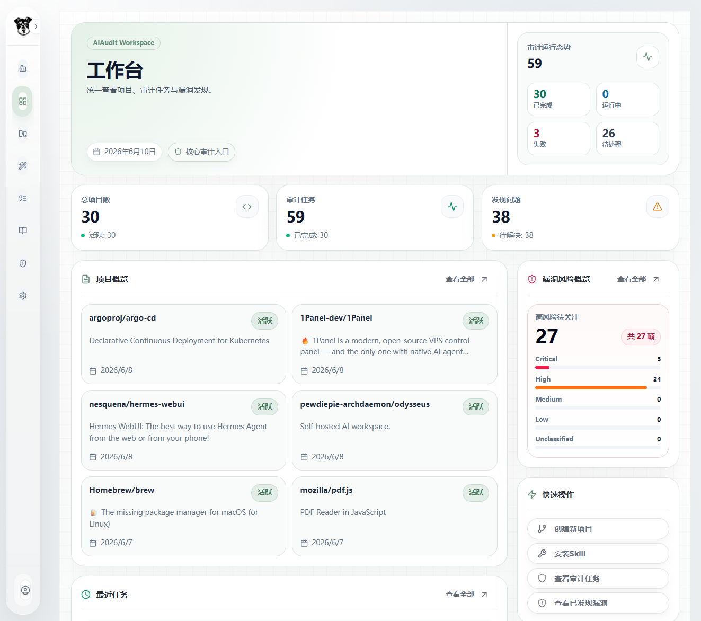

## Table of Contents

- [1. System Requirements](#1-system-requirements)
- [2. Quick Start](#2-quick-start)
- [3. Model Configuration](#3-model-configuration)
- [4. Workflow Management](#4-workflow-management)
- [5. Project Management](#5-project-management)
- [6. Audit Tasks](#6-audit-tasks)
- [7. Vulnerability Management](#7-vulnerability-management)
- [8. Skills Management](#8-skills-management)

## 1. System Requirements

AutoCVE is a frontend-backend separated AI code security audit platform. Core services include:

- Frontend: React + Vite, default port `3000`
- Backend: FastAPI, default port `8000`
- Database: PostgreSQL 15
- Cache/task status: Redis 7
- Sandbox image: `autocve-sandbox:latest`, used for secure tool execution and PoC verification
- Optional management tool: Adminer, default port `8080`

### Recommended Configuration

| Resource | Recommended Configuration | Description |
| --- | --- | --- |
| CPU | 4 cores or more | Agent auditing, dependency scanning, and repository cloning consume CPU |
| Memory | 8 GB or more | Small projects can run with 4 GB; large projects are recommended to start from 8 GB |
| Disk | 20 GB or more | Required for images, database, uploaded ZIPs, project workspaces, and audit results |
| Docker | Docker 20.10+ | Docker Compose deployment is recommended |
| Docker Compose | 2.24.0+ | Uses the `docker compose` command and supports optional `env_file` configuration |
| Network | Access to model APIs and GitHub/GitLab/Gitea | One-click CVE, repository import, and model calls depend on external networks |

### Local Development Dependencies

If you do not use Docker and instead run local development directly, you need:

- Node.js 20+
- pnpm or npm
- Python 3.11+
- uv
- PostgreSQL 15+
- Redis 7+

### Account Notes

The system creates a demo account during initialization:

```text
Email: demo@example.com
Password: demo123
```

After deploying to production, promptly change the default account password or delete the demo account.

## 2. Quick Start

Docker Compose is the most recommended deployment method. It starts the frontend, backend, database, Redis, sandbox image, and Adminer at the same time.

### 2.1 Clone the Project

```bash
git clone <your-repository-url>
cd AutoCVE
```

If you already have the project directory locally, just enter the project root directory.

### 2.2 Quick Start

After entering the project root directory, execute:

```bash
docker compose up -d --build
```

This command automatically starts the frontend, backend, database, Redis, sandbox image, and Adminer. After startup completes, open `http://localhost:3000`, log in with the demo account, and then go to "System Settings > Model Configuration" to fill in model information.

### 2.3 Check Service Status

Check service status after startup:

```bash
docker compose ps
```

Common service addresses:

| Service | Address | Purpose |
| --- | --- | --- |
| Frontend | http://localhost:3000 | User interface |
| Backend API | http://localhost:8000 | API service |
| Swagger | http://localhost:8000/docs | API debugging documentation |
| Adminer | http://localhost:8080 | Database management |

### 2.4 First Login

Open:

```text
http://localhost:3000
```

Log in with the demo account:

```text
demo@example.com / demo123
```

After logging in, it is recommended to complete two things first:

1. Go to "System Settings > Model Configuration" and confirm that the model is available.
2. Go to "Project Management", import a test project, and create an Agent audit task.


## 3. Model Configuration

Feature entry:

```text
System Settings > Model Configuration
```

Interface overview:

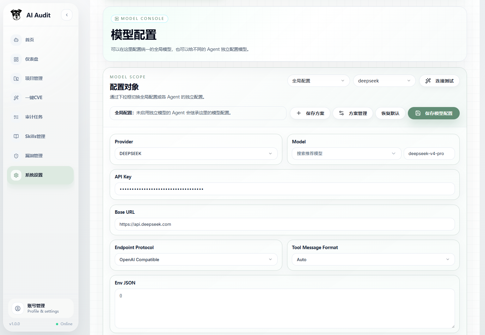

### 3.1 Global Model Configuration

Go to "System Settings > Model Configuration" and configure the global model first. The global model is the default model for all Agents. When a certain Agent does not independently enable model configuration, it falls back to the global configuration.

Common fields:

| Field | Description |
| --- | --- |
| Provider | Model provider, for example `openai`, `gemini`, `claude`, `qwen`, `deepseek`, `zhipu`, `moonshot`, `ollama`, `baidu`, `minimax`, `doubao` |
| Model | Model name, which can be selected from the recommendation list or entered manually |
| API Key | Model API key |
| Base URL | Model vendor or relay station Base URL |
| Max Iterations | Maximum Agent loop count |
| Endpoint Protocol | Model protocol; supports OpenAI Compatible, Anthropic, Google |
| Tool Message Format | Tool message format; supports Auto, Follow Protocol, XML, JSON |
| Env JSON | Additional environment variables for model calls; must be a valid JSON object |

After configuration, click "Connection Test" to confirm connectivity. After confirming there are no errors, click "Save Model Configuration".

### 3.2 Model Plans

Model plans are used to save a reusable set of model configurations, making it easy to quickly switch between different model configurations.

Common operations:

- Save plan: save the current global model configuration as a named plan.
- Set as default plan: this plan is applied when restoring defaults.

  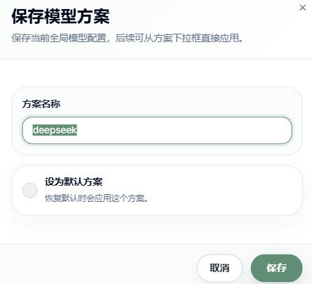

- Apply plan: select the plan to apply from the top drop-down box and click "Save Model Configuration".

  

- Plan management: view, edit, and delete existing plans.
  
  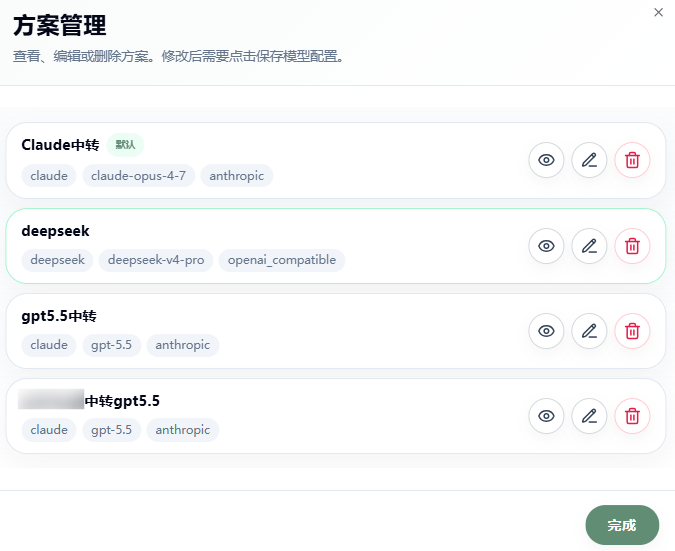

### 3.3 Use Different Models for Different Agents

AutoCVE supports separately configuring models for different Agents. Currently configurable Agents include:

| Agent | Responsibility | Model Recommendation |
| --- | --- | --- |
| Orchestrator | Orchestrates the audit flow and phase branching | Stable models with strong context capability |
| Recon | Information collection, project structure analysis, entry-point discovery | Models with long context and strong code understanding |
| Scan | Calls scan tools and organizes tool output | Low-cost models with stable formatting |
| Triage | False-positive filtering | Stable judgment models that can follow evidence |
| Finding | Deep vulnerability discovery, attack-chain construction, report generation | Models with strong reasoning and code understanding |
| Verification | Dynamic vulnerability verification | Models with strong reasoning and conservative reliability |
| audit_chat | User conversation | Models with good conversational experience and context understanding |

Switch the configuration scope in "Model Configuration":

```text
Global -> Orchestrator -> Recon -> Scan -> Triage -> Finding -> Verification
```

When a certain Agent's configuration is enabled, that Agent uses its own model parameters first. When it is not enabled, it uses the global model.

Each Agent can independently set:

- Provider
- Model
- API Key
- Base URL
- Endpoint Protocol
- Tool Message Format
- Max Iterations
- Env JSON

### 3.4 Relay Station Protocol Selection

If you use a relay station, Provider should be selected according to the external API protocol exposed by the relay station, not only according to the model name. For example, a relay station may connect to a GPT model behind the scenes, but if it exposes an Anthropic/Claude-compatible API externally, Provider needs to be CLAUDE, and Model should be filled with the actual model name, such as gpt-5.x. If the relay station exposes an OpenAI Chat Completions compatible API externally, Provider should be OPENAI.

The tool-call formats of the two protocol types are different:
OpenAI uses the function call message structure:
```http
POST https://host/v1/chat/completions
Authorization: Bearer sk-...

{
  "model": "gpt-5.5",
  "messages": [
    {"role": "system", "content": "..."},
    {"role": "user", "content": "..."}
  ],
  "tools": [
    {
      "type": "function",
      "function": {
        "name": "Read",
        "parameters": {...}
      }
    }
  ]
}
```
Claude/Anthropic uses tool_use / tool_result message blocks:
```http
POST https://host/v1/messages
x-api-key: sk-...
anthropic-version: xxxx-xx-xx

{
  "model": "claude-opus-4-8",
  "system": "...",
  "messages": [
    {
      "role": "user",
      "content": [{"type": "text", "text": "..."}]
    }
  ],
  "tools": [
    {
      "name": "Read",
      "input_schema": {...}
    }
  ]
}
```
Ensure that Provider matches the relay station protocol. Otherwise, regular text conversation may be usable, but Agent tool calls, audit loops, or result submission may fail.


## 4. Workflow Management

Feature entry:

```text
System Settings > Workflow Management
```
Interface overview:

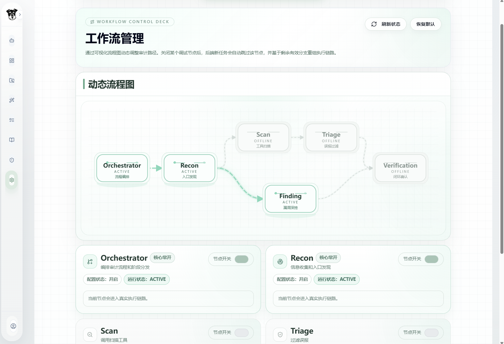

Workflow management is used to dynamically control which Agent nodes new audit tasks will execute.

Default flow:

```text
Orchestrator -> Recon -> Scan -> Triage -> Verification
                      \-> Finding -> Verification
```

Node description:

| Node | Core and Always On | Description |
| --- | --- | --- |
| Orchestrator | Yes | Responsible for audit task orchestration; cannot be turned off |
| Recon | Yes | Responsible for project information collection; cannot be turned off |
| Scan | No | Calls scanning tools such as Semgrep and Bandit |
| Triage | No | Filters false positives in scan results |
| Finding | No | Performs deep vulnerability discovery based on project context |
| Verification | No | Dynamic vulnerability verification (unstable) |

Workflow switch rules:

- Orchestrator and Recon are always enabled.
- After Scan is disabled, Triage is skipped because it loses its upstream input.
- Verification enters the execution chain only when Finding is enabled or Scan + Triage is valid.
- Configuration affects only subsequently created tasks and does not change tasks that are already running or completed.

Usage suggestions:

- Quick experience: keep the default workflow.
- Only perform deep vulnerability discovery: enable Finding and optionally disable Scan/Triage.
- Only perform tool scanning and false-positive filtering: enable Scan/Triage and optionally disable Finding.

## 5. Project Management

Feature entry:

```text
Project Management
```
Interface overview:

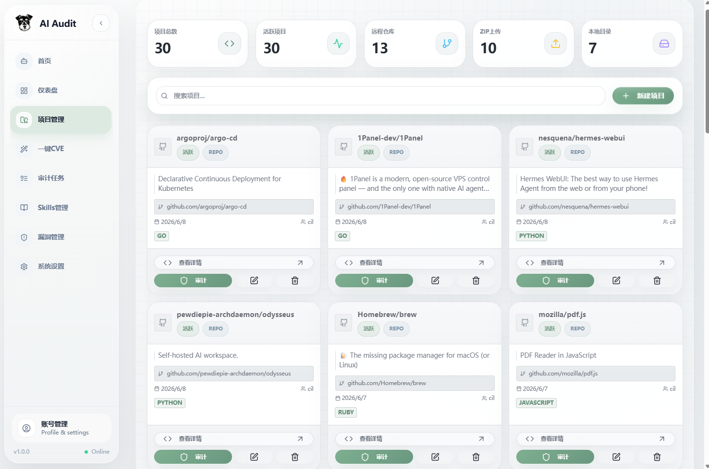

This page is used to create projects, upload source code, manage branches, edit project metadata, delete projects, and directly create audit tasks from project entries.

### 5.1 Project Creation

Currently, three types of project sources are supported:

| Type | Description | Applicable Scenario |
| --- | --- | --- |
| Remote repository | Import through GitHub, GitLab, Gitea, or another Git URL | Auditing open-source projects |
| ZIP upload | Upload a `.zip` source code package; the system extracts it as a persistent source directory | Auditing local code |


#### 5.1.1 Import Project from Git Repository

Operation steps:

1. Open "Project Management".
2. Click the "New Project" button.
3. Select "Git Repository".
4. Fill in the project name.
5. Fill in the project description, optional.
6. Select the repository source: GitHub, GitLab, Gitea, or Other.
7. Fill in the repository URL.
8. Select or fill in the default branch.
9. Select project language tags.
10. Click "Execute Creation".

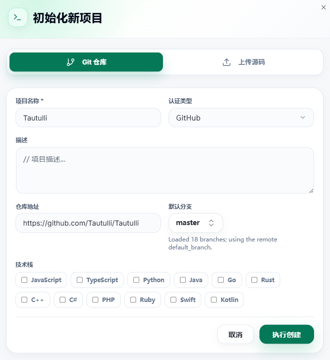

Repository URL suggestion:

```text
GitHub HTTPS: https://github.com/owner/repo
```

Token configuration suggestions:

- GitHub private repositories require `GITHUB_TOKEN` or a user-level GitHub Token
- GitLab private repositories require `GITLAB_TOKEN`
- Gitea private repositories require `GITEA_TOKEN`
- SSH repositories require saving an SSH private key in system configuration

Tip: When creating a project, the system attempts to obtain the remote default branch and branch list. If acquisition fails, it falls back to the default branch entered by the user.

#### 5.1.2 Import Project from Local

Operation steps:

1. Open "Project Management".
2. Click the "New Project" button.
3. Select "Upload Source Code".
4. Fill in the project name and description.
5. Select project language tags.
6. Select a `.zip` file.
7. Submit the upload.
8. Click "Execute Creation".

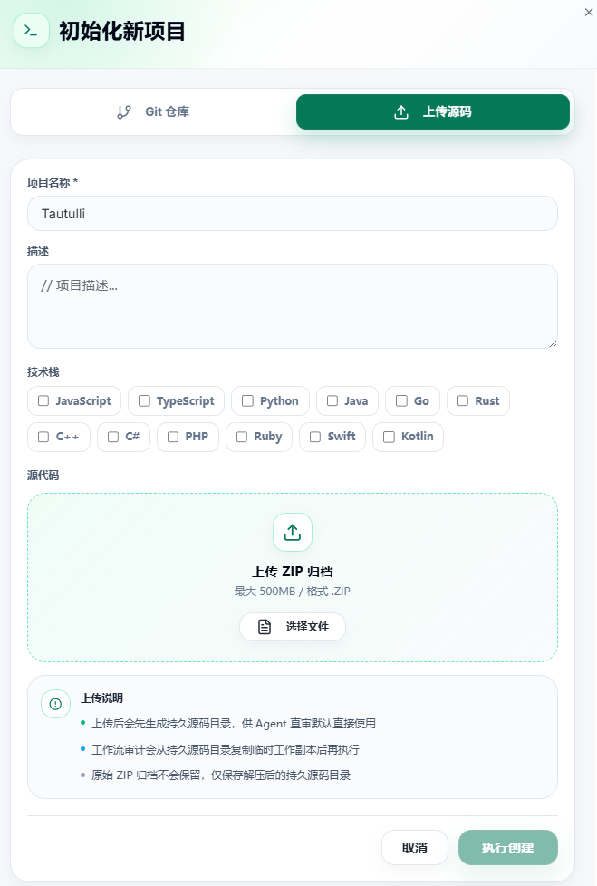

Tips:

- Only `.zip` is supported
- Maximum single ZIP size is 500 MB
- A persistent source directory is generated after upload
- Workflow auditing copies from the persistent source directory to a temporary workspace before execution

### 5.2 Project List

The project list supports:

- Searching by project name or description
- Viewing project source type
- Viewing repository platform, default branch, and language tags
- Entering project details
- Creating audit tasks directly
- Editing projects
- Deleting projects

Tip: Deleting a project permanently deletes the project record and associated audit data. Confirm that the project is no longer needed before deleting.

### 5.3 Project Details

The project details page includes:

- Project overview: repository URL, project type, platform, default branch, creation time, owner, language tags
- Recent activity: recent audit tasks
- Audit tasks: view historical tasks and enter task details
- Issue management: summarizes all vulnerabilities discovered in historical audits for this project
- Project settings: edit project name, description, repository URL, branch, and language


## 6. Audit Tasks

Feature entry:

```text
Project Management
```
Interface overview:

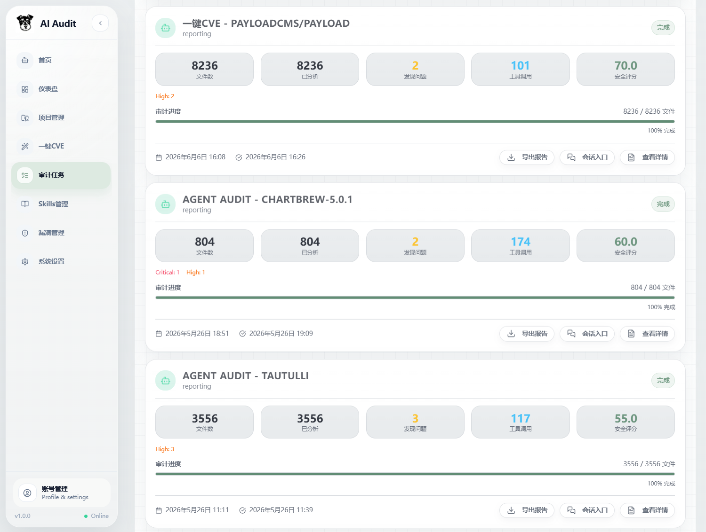

### 6.1 Create Agent Audit Task

Usually, audit tasks are created through the following two entries:

- Project Management: create an audit task after selecting a project
- Project Details: click "Start Audit"

Operation steps:

1. Select a project
2. Enter project version number
3. Select audit mode
4. Select whether to enable dynamic verification
5. Open advanced options and select scan scope as needed
6. Configure exclusion rules as needed
7. Start auditing

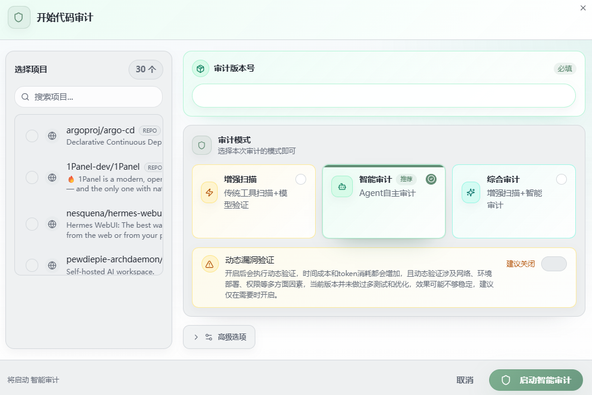

Currently three audit modes are supported:

| Mode | Description | Core Agent | Applicable Scenario |
| --- | --- | --- | --- |
| Enhanced Scan | Traditional tool scanning + model verification | Scan → Triage | Quickly analyze tool scan results |
| Intelligent Audit | Agent autonomous audit | Finding | Quickly produce high-quality vulnerabilities; suitable for CVE and 0Day discovery |
| Comprehensive Audit | Enhanced scan + intelligent audit | Scan → Triage + Finding | Perform full-scale auditing of a project |

### 6.2 Audit Runtime Page

After an audit task is created, it enters:

```text
/agent-audit/{taskId}
```

The page mainly consists of three parts:

- Left activity log: displays real-time Agent activities, reasoning, tool calls, and result output
- Right Agent Tree: displays currently participating Agents, hierarchy, and runtime status
- Statistics panel: displays file count, tool call count, vulnerability count, severity distribution, etc.

The activity log is updated in real time through SSE. If the connection is interrupted, the page attempts to load historical events and restore display.

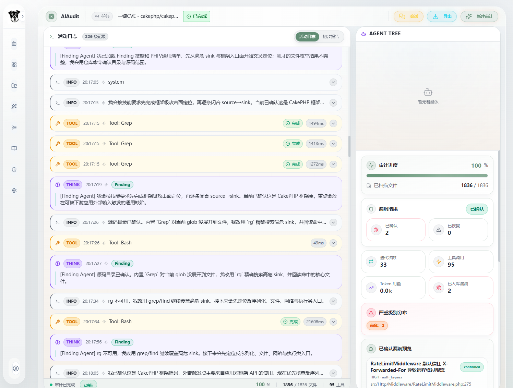

#### 6.2.1 Activity Log

The activity log displays:

- Agent reasoning process
- Tool call input
- Tool call output
- Phase switches
- Final results

Log types include:

- `thinking`: model reasoning and decision process
- `tool`: tool call
- `info`: regular status information
- `error`: error information
- `dispatch`: Agent handoff
- `user`: user input

#### 6.2.2 Preliminary Report

After the task completes, the page displays an "Activity Log / Preliminary Report" switch.

The preliminary report displays:

- Vulnerability title
- Risk level
- Vulnerability type
- Confidence
- File path and line number
- Vulnerability description
- Source / Sink
- Impact description
- Exploit chain
- PoC information
- Verification notes


The preliminary report is only for display. More detailed reports are synchronized in vulnerability management.

### 6.3 User Conversation

The Finding Agent audit process is synchronized to a runtime session. Feature entry:

```text
/audit-sessions/{sessionId}
```


The user conversation feature treats the entire audit process as session context, allowing users to continue asking follow-up questions after the audit completes.

Page composition:

- Main timeline: displays user messages, model replies, and tool call results
- Right audit records: displays Trace, Agent handoffs, tool calls, Skill usage, and memory records
- Follow-up input box: continue asking questions to the audit session

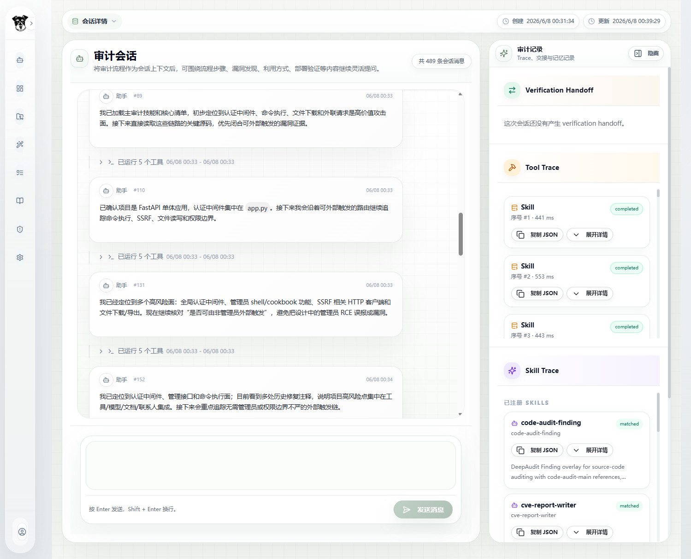

You can expand and view tool call details.


You can enter `$` to display Skill invocation. If no model is specified, the system automatically matches suitable Skills according to the task.


You can use the audit process as context for arbitrary conversation, such as asking the Agent questions about the audit flow, supplementing vulnerability content, or giving detailed explanations of deployment exploitation.


### 6.4 Cancel Task

Running Agent audit tasks support cancellation. After clicking the cancel button on the audit page, the backend marks the task as cancelled, and the currently running execution loop stops at a safety check point.

After cancellation:

- Saved events can still be viewed
- Produced Findings are still retained
- Unfinished phases will not continue executing

## 7. Vulnerability Management

Feature entry:

```text
Vulnerability Management
```
Interface overview:

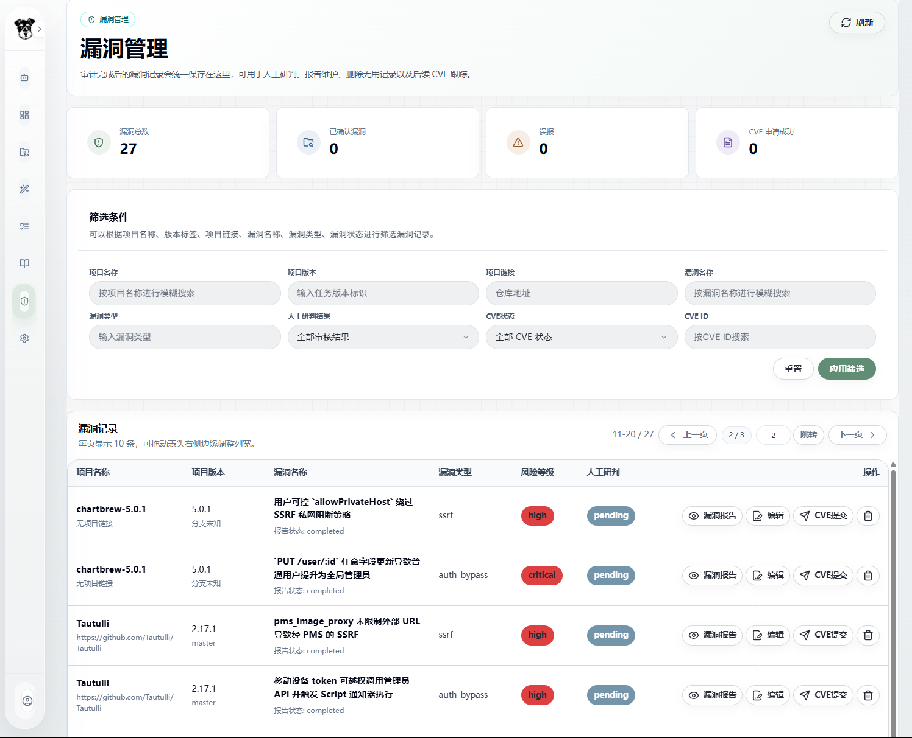

Vulnerabilities after audit completion are centrally saved here, making it convenient for manual review, report maintenance, CVE application tracking, and result export.

### 7.1 Vulnerability Filtering

Filtering by the following fields is supported:

| Field | Purpose |
| --- | --- |
| Project name | Fuzzy search by project name |
| Project version | Search by version |
| Project link | Search by repository URL |
| Vulnerability name | Fuzzy search by vulnerability title |
| Vulnerability type | For example SSRF, SQL Injection, XSS, RCE |
| Manual review result | Pending confirmation, confirmed, false positive |
| CVE status | Not applied, applying, application succeeded, application failed |
| CVE ID | Search by CVE identifier |


### 7.2 View Vulnerability Report

After clicking "Vulnerability Report", a vulnerability report dialog opens. The report contains three tabs:

- Chinese report
- English Report
- CVE report

The report supports:

- Preview
- Markdown editing
- Real-time preview
- Save changes
- Reset to original content
- Copy Markdown
- Export Markdown

Report content usually includes:

- Summary
- Details
- POC
- Impact
(The four items above can be directly copied for submitting vulnerability reports from GitHub Advisory, as shown below.)
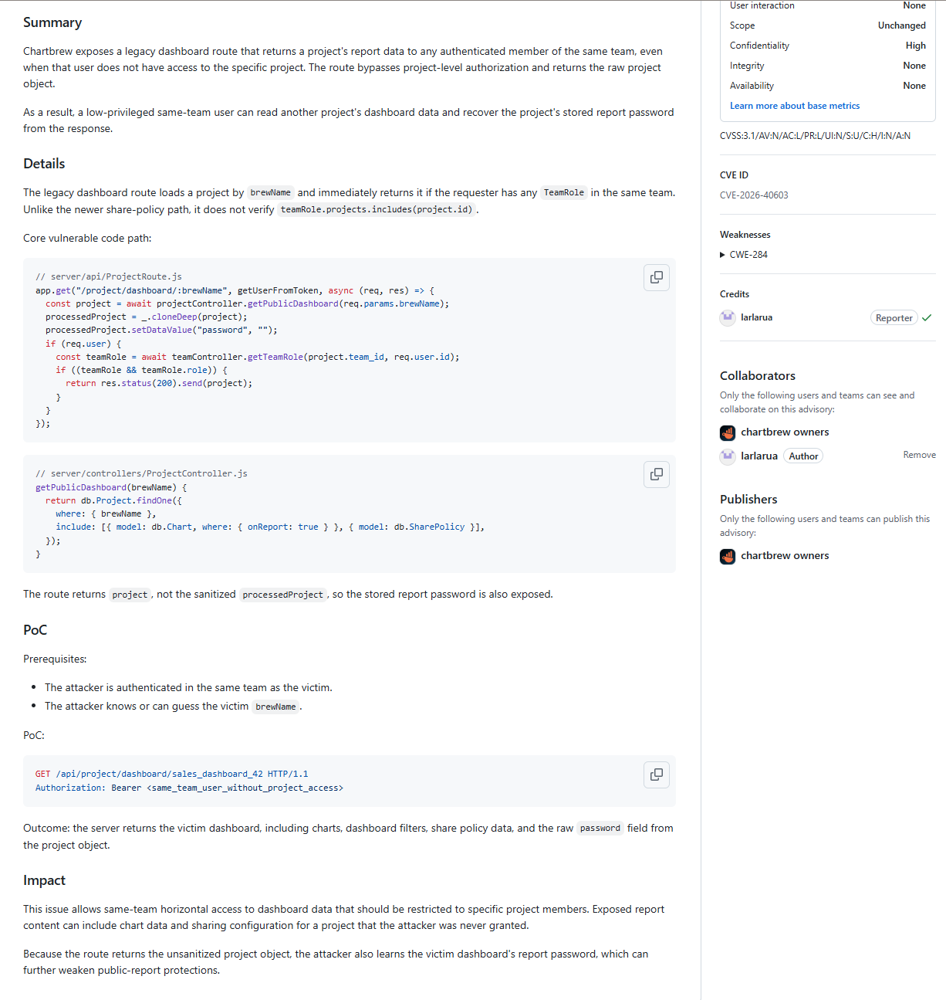
- Remediation
- Disclosure Notes
- Affected products
- CVSS
- CWE
- Suggested description of the vulnerability for use in the CVE

Report example:


### 7.3 Edit Vulnerability Record

After clicking edit, you can modify:

- Vulnerability name
- Vulnerability type
- Risk level
- Manual review result
- CVE application status
- CVE ID
- CVE failure reason

Manual review suggestions:

- After confirming reproducibility or a complete evidence chain, set it to "confirmed".
- When it is clearly not a vulnerability or lacks an exploitable path, set it to "false positive".
- When the evidence has not been fully reviewed, keep it as "pending confirmation".

CVE status suggestions:

- Before submission: not applied
- Submitted to maintainer or CNA: applying
- CVE ID obtained: application succeeded, and fill in CVE ID
- Rejected or insufficient evidence: application failed, and fill in the failure reason

## 8. Skills Management

Feature entry:

```text
Skills Management
```
Interface overview:


### 8.1 Skill Purpose

Skills allow Agents to have more specialized knowledge and workflows in specific tasks, for example:

- Java deserialization auditing
- PHP file upload vulnerability auditing
- SSRF detection methods
- CVE report writing
- huntr submission workflow
- Enterprise internal security specifications

The system parses available Skills according to Agent type, binding relationships, and task context.

### 8.2 Skill Root Directory

The top of the page displays the Skill root directory, usually:

```text
[project root]/skill_library
```

In Docker deployment, the corresponding mount is:

```text
./skill_library:/app/skill_library
```

You can also directly place Skill folders under `skill_library/`, and then click "Sync Local Directory".

### 8.3 Bind Skills to Agents

The page supports selecting Agents:

- orchestrator Agent
- recon Agent
- scan Agent
- triage Agent
- finding Agent
- verification Agent
- user conversation

The right side of each Skill card has a switch for enabling or disabling that Skill's binding to the current Agent.

Binding recommendations:

| Agent | Recommended Binding Type |
| --- | --- |
| Recon | Skills for project structure identification, framework identification, and attack surface mapping |
| Scan | Skills for tool usage, security scanning, and rule interpretation |
| Triage | Skills for false-positive filtering, evidence judgment, and vulnerability classification |
| Finding | Skills for vulnerability-specific methods and CVE discovery methods |
| Verification | Skills for PoC verification, sandbox verification, and reproducibility judgment |
| User conversation | Add suitable Skills according to actual user scenarios and usage habits |

### 8.4 Edit Skill Metadata

Click "Edit" to modify:

- Name
- Slug
- Description
- Source type
- Source URL

Note: This area mainly edits metadata and is not suitable for directly editing long `SKILL.md` content. If major changes to the Skill body are needed, it is recommended to directly edit `skill_library/<skill>/SKILL.md` and then sync.

### 8.5 Import GitHub Skill

Click "Import GitHub Skill" and fill in the GitHub repository URL.

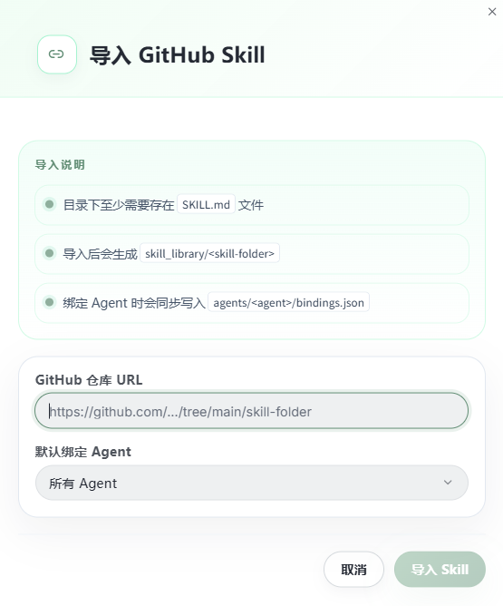


Requirements:

- The target directory must contain at least `SKILL.md`
- After import, `skill_library/<skill-folder>` is generated
- When binding Agents, the binding is synchronously written to `agents/<agent>/bindings.json`

You can choose:

- Bind to all Agents
- Bind only to a specific Agent

After import completes, the system synchronizes the local skill library.

### 8.6 Upload Skill ZIP

Click "Upload Skill" and select a ZIP file.

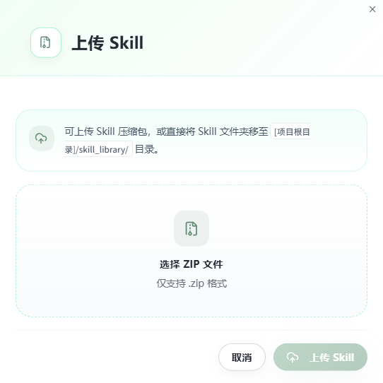

ZIP package requirements:

- Must contain `SKILL.md`
- It is recommended that one ZIP correspond to one Skill folder
- Can include extension directories such as `references/`, `scripts/`, and `assets/`

After upload completes, refresh the Skills page to confirm successful import.

### 8.7 Delete Skill

Deleting a Skill deletes:

- Skill folder
- `SKILL.md`
- Extension resources
- All Agent binding records

This operation cannot be undone within the page. Confirm that you have backed it up before deleting.
